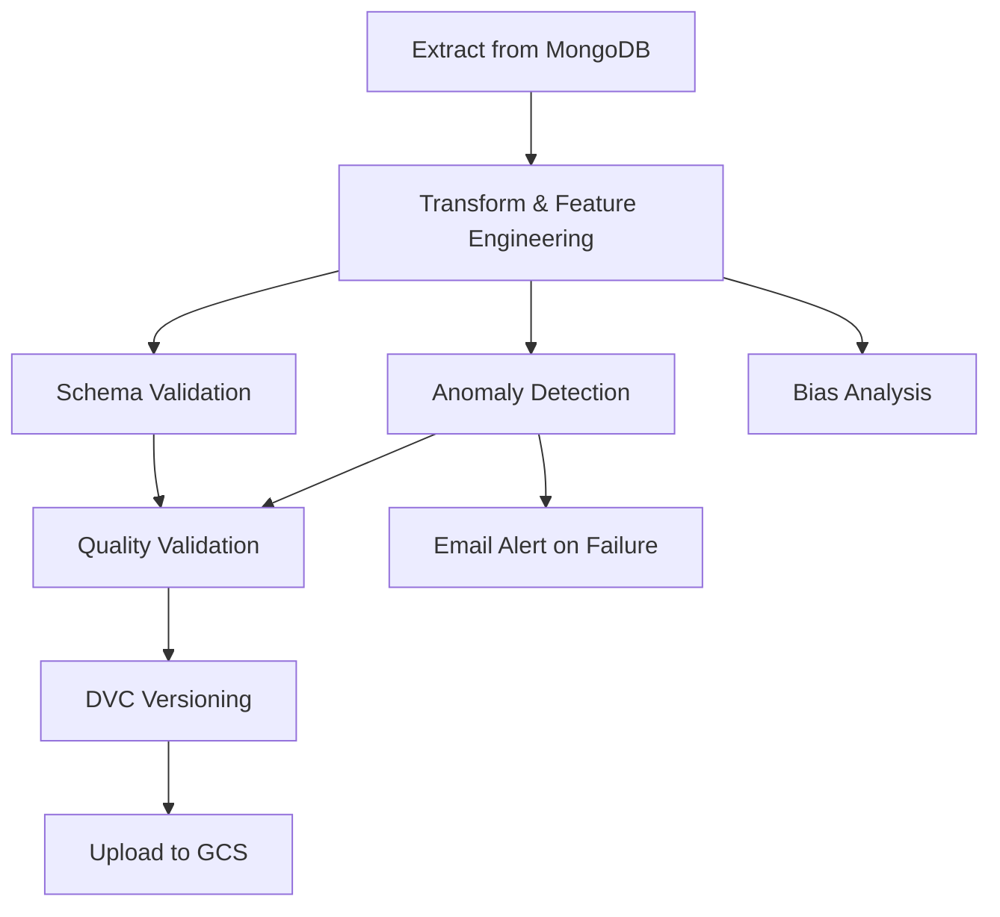

# AI-based-Supply-Chain-Management

## Overview

This repository contains a comprehensive MLOps implementation of an AI-driven retail supply chain intelligence system that demonstrates production-ready machine learning pipelines with robust monitoring, validation, and governance capabilities. The project focuses on demand forecasting and inventory visibility at a store–product level, using production-oriented machine learning pipelines deployed on Google Cloud Platform (GCP).

The system is designed to forecast short-term demand, surface inventory risk signals (such as potential stockouts or overstock scenarios), detect data anomalies and bias, and provide comprehensive monitoring and alerting capabilities through automated pipelines.

## Architecture Overview

The system follows a production-oriented MLOps architecture with comprehensive data governance and monitoring:

- **Storage**: MongoDB for raw data, Google Cloud Storage for processed features and versioned data
- **Pipelines**: Airflow-orchestrated data preprocessing, feature engineering, validation, and monitoring
- **Data Version Control**: DVC for tracking data and model versions alongside code
- **Quality Assurance**: Schema validation with Great Expectations and comprehensive anomaly detection
- **Bias Detection**: Automated bias analysis across multiple data slices with mitigation strategies
- **Monitoring**: Real-time anomaly detection, email alerts, and comprehensive logging
- **Serving**: Batch forecasts with optional online inference endpoints

## Key Features

### Core Pipeline Components
- **Daily demand forecasting** at store–product granularity with time-series feature engineering
- **Automated training and batch inference pipelines** with Airflow orchestration
- **Model versioning and experiment tracking** through DVC integration
- **Data and prediction drift monitoring** with automated alerting

### Data Quality & Validation
- **Schema validation** using Great Expectations with automated statistics generation
- **Comprehensive anomaly detection** for missingness, outliers, and date gaps
- **Data quality checks** with configurable thresholds and automated reporting

### Bias Detection & Mitigation
- **Automated bias analysis** across multiple slices (Store ID, Product ID, Weather, Seasonality, Promotions)
- **Sample weight calculation** for bias mitigation in model training
- **Performance analysis** by demographic and operational segments

### Monitoring & Alerting
- **Real-time anomaly detection** with configurable thresholds
- **Email alert system** for critical anomalies and pipeline failures
- **Comprehensive logging** throughout the pipeline with structured error handling

### Cloud Integration & Version Control
- **Google Cloud Storage integration** for scalable data storage
- **Data Version Control (DVC)** for tracking data and model versions
- **Containerized deployment** with Docker Compose for reproducibility

## Dataset

The project uses a synthetic retail inventory forecasting dataset containing daily sales, inventory levels, pricing, promotions, holidays, and weather information across multiple stores and products. While synthetic, the dataset is structured to resemble real-world retail demand data and is used to validate system design and MLOps workflows.

Precomputed demand forecast fields present in the dataset are excluded from training to prevent data leakage.

## Tech Stack

### Core Technologies
- **Python 3.9+** with comprehensive data science libraries
- **Apache Airflow 3.0** for pipeline orchestration and scheduling
- **MongoDB** for raw data storage
- **Google Cloud Platform** (GCS)

### MLOps & Data Quality
- **Data Version Control (DVC)** for data and model versioning
- **Great Expectations** for data validation and schema enforcement
- **Pandas & NumPy** for data processing and feature engineering
- **SciPy** for statistical analysis and anomaly detection

### Monitoring & Communication
- **SMTP Email Provider** for automated alerts and notifications
- **Structured Logging** with comprehensive error tracking
- **Docker Compose** for containerized deployment

## Project Structure

```
AI-based-Supply-Chain-Management/
├── dags/
│   └── data_pipeline.py          # Main Airflow DAG with ETL and monitoring
├── scripts/
│   ├── __init__.py
│   ├── validate.py               # Schema validation with Great Expectations
│   ├── anomaly.py                # Comprehensive anomaly detection
│   ├── bias.py                   # Bias detection and mitigation
│   ├── upload_to_gcp.py          # GCS upload functionality
│   └── upload_to_mongo.py        # MongoDB data loading
├── tests/
│   ├── README.md                 # Testing guide and coverage details
│   └── test_data_pipeline.py     # Unit tests for pipeline components
├── docker-compose.yaml           # Airflow deployment configuration
├── run_tests.sh                 # Test runner script
├── params.yaml                   # Pipeline parameters and thresholds
├── requirements.txt              # Python dependencies
└── README.md                     # This documentation
```

## Pipeline Flow

The Airflow DAG implements a comprehensive ETL pipeline with parallel quality checks:



### Pipeline Stages

1. **Extract**: Pull raw inventory data from MongoDB
2. **Transform**: Feature engineering with lag features, rolling statistics, and calendar features
3. **Validate**: Schema validation and statistics generation using Great Expectations
4. **Detect**: Comprehensive anomaly detection (missingness, outliers, date gaps)
5. **Analyze**: Bias detection across multiple data slices
6. **Version**: Data versioning with DVC and GCS remote storage
7. **Load**: Upload processed features to Google Cloud Storage
8. **Alert**: Email notifications for critical anomalies

## Configuration

### Environment Variables
- `GCS_BUCKET_NAME`: Google Cloud Storage bucket for data storage
- `GOOGLE_APPLICATION_CREDENTIALS`: Path to GCP service account key
- `EMAIL_RECIPIENTS`: Comma-separated list of alert recipients
- `MONGO_URI`: MongoDB connection string
- `PARAMS_PATH`: Path to pipeline parameters file

### Pipeline Parameters (params.yaml)
```yaml
horizon: 1                                    # Forecast horizon in days
lags: [1, 7, 14]                            # Lag feature periods
rolling_windows: [7, 14, 28]                # Rolling window sizes
anomaly_thresholds:
  z_score: 3.0                               # Outlier detection threshold
  iqr: 1.5                                   # Interquartile range multiplier
  missingness: 0.02                          # Missing data threshold (2%)
  date_gap_days: 1                           # Maximum allowed date gap
output_base_path: /opt/airflow/data          # Data output directory
```

## Quick Start

### Prerequisites
- Docker and Docker Compose
- Google Cloud Platform account with Storage API enabled
- MongoDB instance (local or cloud-hosted)
- SMTP server for email alerts (optional)

### Setup Steps

1. **Clone the repository**
   ```bash
   git clone <repository-url>
   cd AI-based-Supply-Chain-Management
   ```

2. **Configure environment variables**
   ```bash
   # Create .env file with required variables
   echo "GCS_BUCKET_NAME=your-bucket-name" >> .env
   echo "GOOGLE_APPLICATION_CREDENTIALS=./gcp-key.json" >> .env
   echo "EMAIL_RECIPIENTS=admin@example.com" >> .env
   ```

3. **Place GCP credentials**
   ```bash
   # Download service account key and place as gcp-key.json
   ```

4. **Start the pipeline**
   ```bash
   docker-compose up -d
   ```

5. **Access Airflow UI**
   - Navigate to `http://localhost:8080`
   - Login with username: `airflow`, password: `airflow`

6. **Trigger the pipeline**
   - Enable the `supply_chain_pipeline` DAG
   - Trigger manually or wait for scheduled execution

## Monitoring & Alerting

### Anomaly Detection
The pipeline automatically detects three types of anomalies:

1. **Missingness Spikes**: Features with null percentage exceeding threshold
2. **Outliers**: Statistical outliers in sales, inventory, and price data
3. **Date Gaps**: Missing days in time series per store-product combination

### Email Alerts
Critical anomalies trigger automated email alerts containing:
- Pipeline execution details
- Anomaly summary and counts
- Links to detailed reports
- Airflow dashboard access

### Logging
Comprehensive logging throughout the pipeline includes:
- Data quality metrics
- Feature engineering statistics
- Anomaly detection results
- Error tracking and troubleshooting information

## Testing & Validation

### Unit Tests
Comprehensive unit test suite covering all pipeline components:
- **42 total tests** across extract, transform, load, integration, and edge cases
- **Test Coverage**: Extract (6), Transform (25), Load (4), Integration (4), Edge Cases (3)
- **Run Tests**: `./run_tests.sh` or `python3 -m pytest tests/test_data_pipeline.py -v`

**Note**: Testing is currently separate from the DAG to maintain pipeline performance. CI/CD testing via GitHub Actions will be implemented soon to automate test execution on code changes.

### Schema Validation
Using Great Expectations, the pipeline validates:
- Column existence and data types
- Null value constraints
- Value ranges and sets
- Uniqueness constraints

### Bias Detection
Automated bias analysis across:
- Store ID and Product ID slices
- Weather conditions and seasonality
- Holiday and promotion periods
- Performance metrics by segment

### Data Quality Reports
Generated reports include:
- Schema statistics and validation results
- Anomaly detection summaries
- Bias analysis with mitigation recommendations
- Feature engineering metrics

## Evaluation Criteria Compliance

This implementation addresses all specified evaluation criteria:

### ✅ 1. Proper Documentation
- Comprehensive README with architecture overview
- Well-commented code with inline documentation
- Structured folder organization following MLOps best practices

### ✅ 2. Modular Syntax and Code
- Separate modules for validation, anomaly detection, bias analysis
- Reusable functions with clear interfaces
- Configuration-driven pipeline parameters

### ✅ 3. Pipeline Orchestration (Airflow DAGs)
- Complete Airflow DAG implementation with logical task flow
- Proper error handling and retry mechanisms
- Parallel execution for efficiency

### ✅ 4. Tracking and Logging
- Comprehensive logging throughout all pipeline stages
- Task tracking with Airflow metadata
- Error alerts and notifications via email

### ✅ 5. Data Version Control (DVC)
- Full DVC integration with GCS remote storage
- Data versioning alongside code in Git
- Automated data tracking and pushing

### ✅ 6. Pipeline Flow Optimization
- Parallel task execution where possible
- Efficient data processing with optimized transformations
- Gantt chart visualization available in Airflow UI

### ✅ 7. Schema and Statistics Generation
- Great Expectations integration for schema validation
- Automated statistics generation for all features
- Data quality metrics and reporting

### ✅ 8. Anomaly Detection and Alert Generation
- Comprehensive anomaly detection (missingness, outliers, date gaps)
- Automated email alerts for critical anomalies
- Configurable thresholds and severity levels

### ✅ 9. Bias Detection and Mitigation
- Bias analysis across multiple data slices
- Sample weight calculation for mitigation
- Performance analysis by demographic segments

### ✅ 10. Test Modules
- Modular design enables easy unit testing
- Validation functions can be tested independently
- Anomaly and bias detection have clear testable interfaces

### ✅ 11. Reproducibility
- Docker Compose for consistent environment
- Parameter-driven configuration
- Version-controlled data and dependencies

### ✅ 12. Error Handling and Logging
- Robust error handling at each pipeline stage
- Comprehensive logging for troubleshooting
- Automated alerts for pipeline failures

## Advanced Features

### Feature Engineering
- **Lag Features**: 1-day, 7-day, and 14-day sales lags
- **Rolling Statistics**: 7, 14, and 28-day rolling means
- **Exponential Weighted Moving**: 28-day EWM for trend detection
- **Calendar Features**: Day of week and month encoding
- **Baseline Predictions**: Lag-based baseline for model comparison

### Bias Mitigation Strategies
- **Sample Weighting**: Inverse frequency weighting by store
- **Performance Analysis**: MAE and MAPE by data slices
- **Recommendation Engine**: Automated mitigation suggestions
- **Priority Classification**: High/medium/low priority bias issues

### Anomaly Detection Algorithms
- **Z-Score Detection**: Statistical outlier identification
- **Percentile Method**: P99.9 percentile-based outlier detection
- **Missingness Analysis**: Null percentage spike detection
- **Time Series Gap Detection**: Missing day identification per series

## API Reference

### Core Functions

#### `validate.generate_schema_and_stats(features_path, output_dir)`
Generates schema validation and statistics using Great Expectations.

#### `anomaly.generate_anomaly_report(features_path, output_dir, thresholds)`
Comprehensive anomaly detection with configurable thresholds.

#### `bias.generate_bias_report(features_path, output_dir, slice_features)`
Bias analysis across specified data slices with mitigation recommendations.


## License

This project is licensed under the Apache License 2.0 - see the LICENSE file for details.

