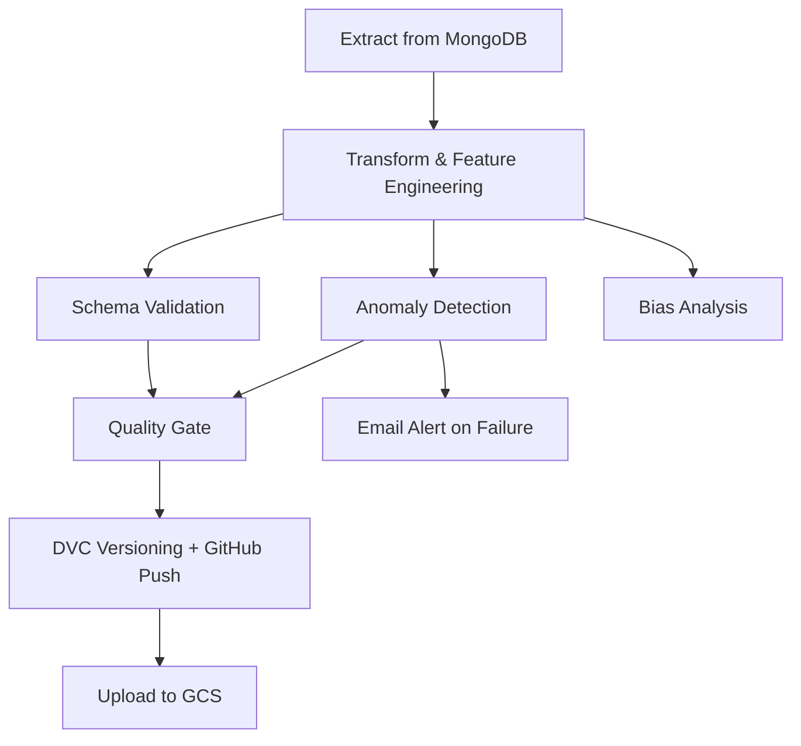
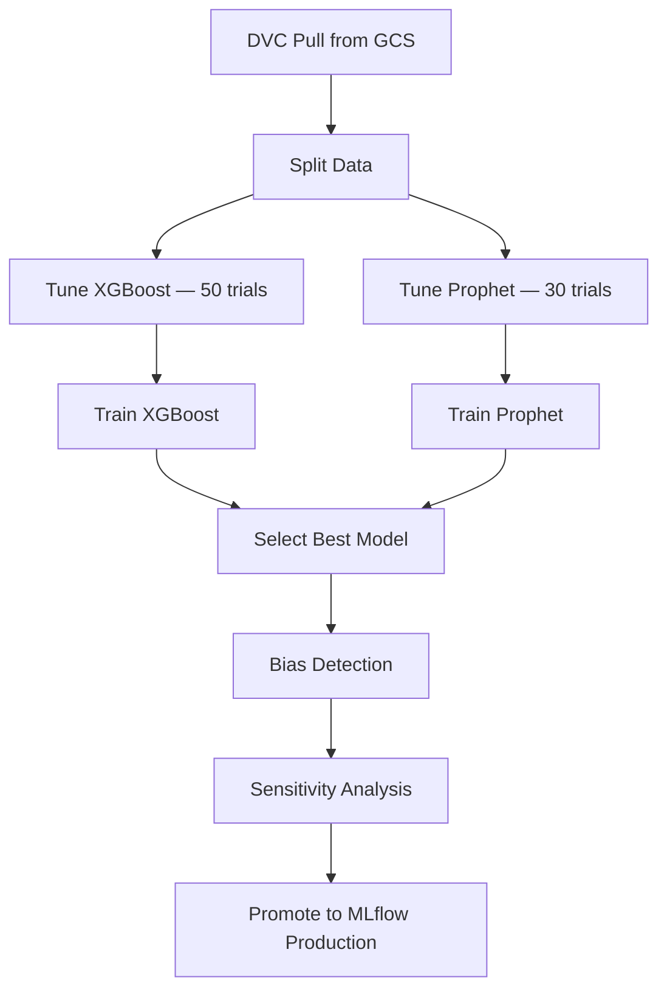

# Suppl.AI


## Overview

This repository contains a comprehensive MLOps implementation of an AI-driven retail supply chain intelligence system that demonstrates production-ready machine learning pipelines with robust monitoring, validation, and governance capabilities. The project focuses on demand forecasting and inventory visibility at a store–product level, using production-oriented machine learning pipelines deployed on Google Cloud Platform (GCP).

The system is designed to forecast short-term demand, surface inventory risk signals (such as potential stockouts or overstock scenarios), detect data anomalies and bias, and provide comprehensive monitoring and alerting capabilities through automated pipelines.

## Architecture Overview

The system follows a production-oriented MLOps architecture with comprehensive data governance and monitoring:

- **Storage**: MongoDB for raw data, Google Cloud Storage for processed features and versioned data
- **Pipelines**: Airflow-orchestrated data preprocessing, feature engineering, validation, and monitoring
- **ML Training**: GitHub Actions CI/CD pipeline triggering model training on data changes
- **Model Registry**: MLflow on Cloud Run for experiment tracking, model versioning, and production promotion
- **Data Version Control**: DVC for tracking data and model versions alongside code
- **Quality Assurance**: Schema validation with Great Expectations and comprehensive anomaly detection
- **Bias Detection**: Automated bias analysis across multiple data slices with mitigation strategies
- **Monitoring**: Real-time anomaly detection, email alerts, and comprehensive logging
- **Serving**: Batch forecasts via MLflow Production stage; MCP-based inference in development

## Key Features

### Core Pipeline Components
- **Daily demand forecasting** at store–product granularity with time-series feature engineering
- **Automated training and batch inference pipelines** with Airflow orchestration
- **Model versioning and experiment tracking** through MLflow and DVC integration
- **Data and prediction drift monitoring** with automated alerting

### ML Model Development
- **Two-model strategy**: XGBoost (global model) and Prophet (per-series) trained and compared each run
- **Bayesian hyperparameter tuning** using Optuna with resumable SQLite-backed studies (50 trials XGBoost, 30 Prophet)
- **Walk-forward cross-validation** with 5 folds and 14-day gap to prevent temporal leakage
- **Automated model selection**: best model promoted to MLflow Production with 5% improvement gate
- **Rollback support**: previous model versions archived and restorable via GitHub Actions workflow

### Data Quality & Validation
- **Schema validation** using Great Expectations with automated statistics generation
- **Comprehensive anomaly detection** for missingness, outliers, and date gaps
- **Data quality checks** with configurable thresholds and automated reporting

### Bias Detection & Mitigation
- **Training-time bias** across Store ID, Product ID, Weather, Seasonality, and Promotions slices with sample weight calculation
- **Inference-time bias detection** across Category, Region, and Seasonality slices — flags disparities >25% above overall MAE
- **CI gate**: bias check failure blocks model deployment in the pipeline
- **Mitigation suggestions** generated automatically per flagged slice

### Sensitivity Analysis
- **SHAP feature importance**: TreeExplainer on 500 test samples, bar + beeswarm plots logged to MLflow
- **Hyperparameter sensitivity**: Optuna parameter importance and parallel coordinate plots
- **Model comparison visualisation**: bar charts of XGBoost vs Prophet on test MAE/RMSE/R²

### Monitoring & Alerting
- **Real-time anomaly detection** with configurable thresholds
- **Email alert system** for critical anomalies and pipeline failures
- **GitHub Actions step summaries** for pipeline success/failure and bias alerts
- **Comprehensive logging** throughout the pipeline with structured error handling

### Cloud Integration & Version Control
- **Google Cloud Storage integration** for scalable data storage and preprocessing artifacts
- **Data Version Control (DVC)** for tracking data and model versions
- **Containerized deployment** with Docker Compose for Airflow and a multi-stage Dockerfile for the ML training environment

## Dataset

The project uses a synthetic retail inventory forecasting dataset containing daily sales, inventory levels, pricing, promotions, holidays, and weather information across multiple stores and products. While synthetic, the dataset is structured to resemble real-world retail demand data and is used to validate system design and MLOps workflows.

Precomputed demand forecast fields present in the dataset are excluded from training to prevent data leakage.

## Tech Stack

### Core Technologies
- **Python 3.11+** with comprehensive data science libraries
- **Apache Airflow 3.0** for pipeline orchestration and scheduling
- **MongoDB** for raw data storage
- **Google Cloud Platform** (GCS, Cloud Run)

### ML & MLOps
- **XGBoost 3.2** and **Prophet 1.3** for demand forecasting
- **Optuna 4.8** for Bayesian hyperparameter optimisation
- **MLflow 2.22** for experiment tracking and model registry (deployed on Cloud Run)
- **SHAP 0.46** for model explainability
- **scikit-learn** for preprocessing and metrics
- **Data Version Control (DVC)** for data and model versioning

### Data Quality
- **Great Expectations** for data validation and schema enforcement
- **Pandas & NumPy** for data processing and feature engineering
- **SciPy** for statistical analysis and anomaly detection

### Monitoring & Communication
- **SMTP Email Provider** for automated alerts and notifications
- **Structured Logging** with comprehensive error tracking
- **Docker Compose** for containerised deployment

## Project Structure

```
AI-based-Supply-Chain-Management/
├── airflow/
│   ├── dags/
│   │   └── data_pipeline.py          # Main Airflow DAG (ETL + quality checks)
│   └── scripts/
│       ├── extract.py                # MongoDB extraction with fingerprinting
│       ├── transform.py              # Feature engineering (lags, rolling, calendar)
│       ├── validate.py               # Schema validation with Great Expectations
│       ├── anomaly.py                # Anomaly detection (z-score, IQR, gaps)
│       ├── bias.py                   # Training-time bias detection & mitigation
│       ├── upload_to_gcp.py          # GCS upload
│       ├── upload_to_mongo.py        # MongoDB loading
│       └── github_push.py            # DVC versioning + GitHub push
├── modelling/
│   ├── models/
│   │   ├── xgboost_model.py          # XGBoost training, evaluation, MLflow logging
│   │   ├── prophet_model.py          # Prophet per-series training and evaluation
│   │   └── optuna_tuning.py          # Bayesian hyperparameter tuning for both models
│   ├── scripts/
│   │   ├── data_splitting.py         # Chronological 80/10/10 split + walk-forward CV
│   │   ├── select_model.py           # Model comparison and MLflow Production promotion
│   │   ├── bias_detection.py         # Inference-time bias detection across slices
│   │   ├── sensitivity_analysis.py   # SHAP analysis + HP sensitivity + model comparison
│   │   ├── inference.py              # Production inference via MLflow
│   │   ├── artifact_io.py            # Scaler + series mapping save/load to GCS
│   │   └── rollback_model.py         # Rollback model to previous MLflow version
│   ├── Dockerfile                    # Multi-stage build for ML training environment
│   └── requirements.txt             # ML dependencies
├── .github/
│   └── workflows/
│       ├── ml_pipeline.yml           # CI/CD: tune → train → validate → promote
│       └── rollback.yml              # Manual model rollback workflow
├── tests/
│   └── test_data_pipeline.py         # Unit tests for pipeline components
├── docker-compose.yaml               # Airflow stack (API server, scheduler, postgres)
├── params.yaml                       # Pipeline parameters and thresholds
├── requirements.txt                  # Root Python dependencies
└── README.md                         # This documentation
```

## Pipeline Flow

### Data Pipeline (Airflow — daily)


```mermaid
graph TD
    A[Extract from MongoDB] --> B[Transform & Feature Engineering]
    B --> C[Schema Validation]
    B --> D[Anomaly Detection]
    B --> E[Bias Analysis]
    C --> F[Quality Gate]
    D --> F
    F --> G[DVC Versioning + GitHub Push]
    G --> H[Upload to GCS]
    D --> I[Email Alert on Failure]
```

### ML Training Pipeline (GitHub Actions — on data change)


```mermaid
graph TD
    A[DVC Pull from GCS] --> B[Split Data]
    B --> C[Tune XGBoost — 50 trials]
    B --> D[Tune Prophet — 30 trials]
    C --> E[Train XGBoost]
    D --> F[Train Prophet]
    E --> G[Select Best Model]
    F --> G
    G --> H[Bias Detection]
    H --> I[Sensitivity Analysis]
    I --> J[Promote to MLflow Production]
```

### Pipeline Stages

1. **Extract**: Pull raw inventory data from MongoDB with fingerprint deduplication
2. **Transform**: Feature engineering — lag features (1/7/14/28 days), rolling stats, EWM, calendar, pricing, inventory
3. **Validate**: Schema validation and statistics generation using Great Expectations
4. **Detect**: Anomaly detection (missingness, z-score outliers, time series date gaps)
5. **Analyze**: Training-time bias detection across store, product, seasonality, weather slices
6. **Version**: Data versioning with DVC and GCS remote storage
7. **Load**: Upload processed features (`features.parquet`) to Google Cloud Storage
8. **Alert**: Email notifications for critical anomalies and pipeline failures

## Feature Set

29 features used for model training:

| Category | Features |
|---|---|
| Lag | `sales_lag_1`, `sales_lag_7`, `sales_lag_14`, `sales_lag_28` |
| Rolling | `sales_roll_mean_7/14/28`, `sales_roll_std_7`, `sales_ewm_28` |
| Pricing | `price_vs_competitor`, `effective_price` |
| Promotions | `Holiday/Promotion`, `Discount`, `discount_x_holiday` |
| Calendar | `dow`, `month`, `is_weekend` |
| Inventory | `Inventory Level`, `stockout_flag`, `lead_time_demand` |
| Supply | `Lead Time Days`, `reorder_event` |
| Encoded | `Category_enc`, `Region_enc`, `Seasonality_enc`, `series_enc` |
| Baseline | `y_pred_baseline`, `demand_forecast_lag1` |

## Configuration

### Environment Variables
- `GCS_BUCKET_NAME`: Google Cloud Storage bucket for data storage
- `GOOGLE_APPLICATION_CREDENTIALS`: Path to GCP service account key
- `EMAIL_RECIPIENTS`: Comma-separated list of alert recipients
- `MONGO_URI`: MongoDB connection string
- `MLFLOW_TRACKING_URI`: MLflow server URL
- `PARAMS_PATH`: Path to pipeline parameters file

### Pipeline Parameters (params.yaml)
```yaml
horizon: 1                                    # Forecast horizon in days
lags: [1, 7, 14]                              # Lag feature periods
rolling_windows: [7, 14, 28]                  # Rolling window sizes
anomaly_thresholds:
  z_score: 3.0                                # Outlier detection threshold
  iqr: 1.5                                    # Interquartile range multiplier
  missingness: 0.02                           # Missing data threshold (2%)
  date_gap_days: 1                            # Maximum allowed date gap
output_base_path: /opt/airflow/data           # Data output directory
```

## Quick Start

### Prerequisites
- Docker and Docker Compose
- Google Cloud Platform account with Storage API enabled
- MongoDB instance (local or cloud-hosted)
- SMTP server for email alerts (optional)

### Setup Steps

1. **Clone the repository**
   ```bash
   git clone <repository-url>
   cd AI-based-Supply-Chain-Management
   ```

2. **Configure environment variables**
   ```bash
   cp .env.example .env
   # Edit .env with your credentials
   ```

3. **Place GCP credentials**
   ```bash
   # Download service account key and place as gcp-key.json
   ```

4. **Start Airflow**
   ```bash
   docker compose up -d
   ```

5. **Access Airflow UI**
   - Navigate to `http://localhost:8080`
   - Login: `airflow` / `airflow`
   - Enable and trigger the `supply_chain_pipeline` DAG

6. **Trigger ML training** (after data is in GCS)
   - Push a `.dvc` file change to `main` or `modelling` branch, or
   - Go to GitHub Actions → "ML Pipeline" → "Run workflow"

## Monitoring & Alerting

### Anomaly Detection
The pipeline automatically detects three types of anomalies:

1. **Missingness Spikes**: Features with null percentage exceeding threshold
2. **Outliers**: Statistical outliers in sales, inventory, and price data
3. **Date Gaps**: Missing days in time series per store-product combination

### Email Alerts
Critical anomalies trigger automated email alerts containing pipeline execution details, anomaly summaries, and links to detailed reports.

### GitHub Actions Summaries
Each pipeline run writes a structured summary to the GitHub Actions Summary tab — best model name and metrics on success, branch/commit/actor on failure, and a separate warning if bias detection flags disparities.

## Testing & Validation

### Unit Tests
Comprehensive unit test suite covering all pipeline components:
- **42 total tests** across extract, transform, load, integration, and edge cases
- **Run Tests**: `./run_tests.sh` or `python3 -m pytest tests/test_data_pipeline.py -v`

### Model Validation
- Walk-forward cross-validation (5 folds, 14-day gap) on training data
- Hold-out test set evaluation with MAE, RMSE, MAPE, R²
- 5% improvement gate before promoting a new model to Production

### Schema Validation
Using Great Expectations: column existence, data types, null constraints, value ranges, uniqueness.

### Bias Detection
- **Training time**: Store, Product, Weather, Seasonality, Promotions slices
- **Inference time**: Category, Region, Seasonality — >25% MAE disparity flags a CI failure

## Evaluation Criteria Compliance

### ✅ 1. Proper Documentation
- Comprehensive README with architecture overview and pipeline diagrams
- Well-commented code with inline documentation

### ✅ 2. Modular Syntax and Code
- Separate modules for each concern: extraction, transformation, validation, anomaly, bias, training, inference
- Configuration-driven pipeline parameters

### ✅ 3. Pipeline Orchestration (Airflow DAGs)
- Complete Airflow DAG with logical task flow, error handling, and parallel execution

### ✅ 4. Tracking and Logging
- MLflow experiment tracking: hyperparameters, metrics, artifacts, model versions per run
- Structured logging and email alerts throughout all pipeline stages

### ✅ 5. Data Version Control (DVC)
- Full DVC integration with GCS remote storage; automated data tracking and push on each run

### ✅ 6. Pipeline Flow Optimisation
- Parallel validation tasks (schema, anomaly, bias run concurrently)
- Resumable Optuna studies across CI runs via SQLite artifact

### ✅ 7. Schema and Statistics Generation
- Great Expectations integration with automated statistics for all features

### ✅ 8. Anomaly Detection and Alert Generation
- Missingness, outlier, and date-gap detection with configurable thresholds and email alerts

### ✅ 9. Bias Detection and Mitigation
- Training-time and inference-time bias analysis with automated mitigation recommendations

### ✅ 10. Test Modules
- 42 unit tests covering extract, transform, load, integration, and edge cases

### ✅ 11. Reproducibility
- Docker Compose for Airflow, multi-stage Dockerfile for ML training, DVC-versioned data

### ✅ 12. Error Handling and Logging
- Robust error handling at each stage with structured logging and automated pipeline failure alerts

### ✅ 13. Model Development
- Two-model strategy (XGBoost + Prophet), Bayesian tuning, walk-forward CV, SHAP analysis, MLflow registry

### ✅ 14. CI/CD for Model Training
- GitHub Actions pipeline: data pull → split → tune → train → bias check → promote, triggered on data changes

## Work in Progress

The following components are under active development and will be integrated into the main branch:

- **Backend API**: REST API layer connecting the frontend to model inference and inventory data
- **Frontend**: Chat-based UI for demand forecasting queries and inventory management
- **MCP-based Inference Agent**: LangGraph agent with two MCP tools — one for inventory management queries (MongoDB) and one for triggering model predictions (MLflow Production model). Both are conversational: users ask questions in natural language and receive demand forecasts or inventory insights in response.

## License

This project is licensed under the Apache License 2.0 - see the LICENSE file for details.
