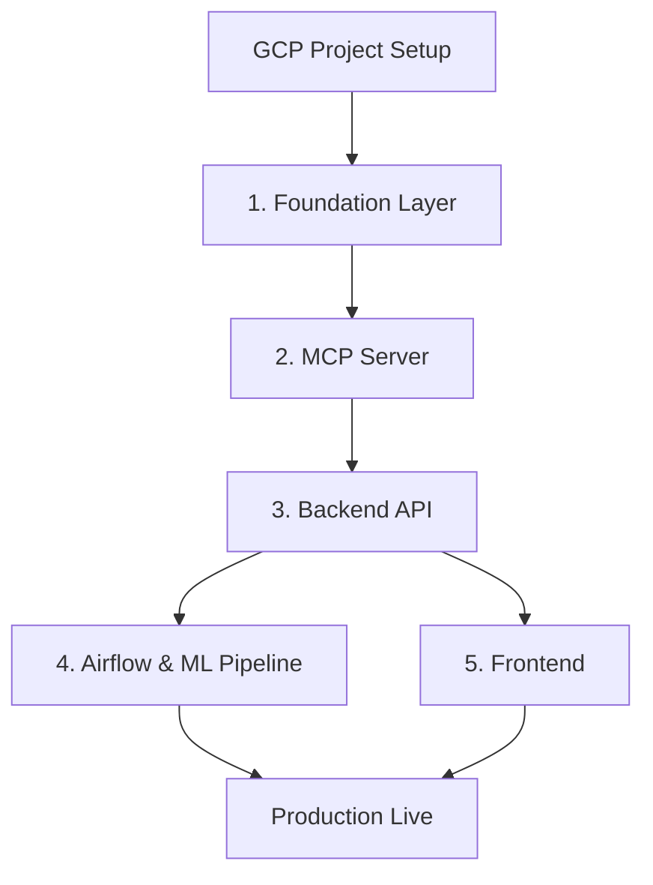

# Deployment Guide: Stratos AI Supply Chain

This document provides a comprehensive guide to deploying the **Stratos** AI-based Supply Chain Management system. The architecture uses a modular, cloud-native approach on **Google Cloud Platform (GCP)** and **Vercel**, managed via **Terraform** and **GitHub Actions**.

---

## 🏗 Architecture Overview

Stratos is split into independent, decoupled services to ensure scalability and maintainability.

- **Foundational Layer**: VPC Networking, Cloud SQL (Postgres), Artifact Registry, and Secret Manager.
- **Data Layer (Airflow)**: Orchstration of ETL, bias detection, and data versioning tasks on Cloud Run.
- **Inference Layer (MCP)**: Model Context Protocol server providing AI tools and ML model forecasting.
- **Application Layer (Backend)**: FastAPI service handling agents, business logic, and API requests.
- **Presentation Layer (Frontend)**: React/Vite application secured by Clerk Auth and hosted on Vercel.

---

## 📋 Prerequisites

Before starting the deployment, ensure you have:

1.  **GCP Account**: A project with billing enabled.
2.  **MongoDB Atlas**: A connection string for the raw inventory database.
3.  **Clerk Auth**: A Clerk account for user authentication.
4.  **Anthropic API Key**: For Claude AI capabilities.
5.  **GitHub Repository**: For CI/CD automation.
6.  **CLIs**: `gcloud`, `terraform`, `npm`, and `python3.11+`.

---

## 🚀 Deployment Sequence

To avoid dependency issues, services **must** be deployed in the following order:



---

## 🛠 1. Foundation Infrastructure

The foundation provides shared resources used by all other services.

### Manual Initialization
```bash
# Enable required APIs
gcloud services enable \
  run.googleapis.com sqladmin.googleapis.com \
  artifactregistry.googleapis.com secretmanager.googleapis.com \
  vpcaccess.googleapis.com compute.googleapis.com

# Create the Terraform state bucket
gsutil mb -L us-central1 gs://$(gcloud config get-value project)-tfstate
```

### Automation
Triggered via `.github/workflows/deploy-foundation.yml` or manually:
```bash
cd terraform/foundation
terraform init -backend-config="bucket=YOUR_PROJECT-tfstate" -backend-config="prefix=foundation"
terraform apply
```

---

## 🤖 2. MCP & Backend Services

Both services run on **Cloud Run** and are deployed using Docker images stored in the Artifact Registry.

- **MCP Server**: Provides the "brain" for forecasting and inventory tools.
- **Backend API**: The gateway for the frontend, handling authentication and agent routing.

### CI/CD Trigger
- Push changes to `mcp/` or `terraform/mcp/` to trigger `deploy-mcp.yml`.
- Push changes to `backend/` or `terraform/backend/` to trigger `deploy-backend.yml`.

---

## 🌊 3. Airflow Data Pipeline

The data pipeline runs on a serverless Airflow 3 architecture using Cloud Run.

- **Scheduler**: Always-on Cloud Run service.
- **Webserver**: Public UI for DAG management.
- **Database**: Managed Cloud SQL (PostgreSQL).

### Deployment
Triggered via `.github/workflows/deploy-airflow.yml`. It handles:
1. Building the custom Airflow Docker image.
2. Provisioning/Updating Cloud Run services.
3. Running a one-time DB migration job (`airflow-init`).

---

## 💻 4. Frontend (Vercel)

The frontend is a React application that communicates with the Backend API.

1.  Connect your GitHub repository to **Vercel**.
2.  Set the **Root Directory** to `frontend`.
3.  Configure Environment Variables:
    - `VITE_CLERK_PUBLISHABLE_KEY`: From your Clerk Dashboard.
    - `VITE_API_BASE_URL`: The URL of your Cloud Run Backend API.

---

## 🔐 GitHub Secrets Configuration

The following secrets must be added to your GitHub Repository (**Settings > Secrets and variables > Actions**) for the pipelines to function:

| Secret Name | Description |
| :--- | :--- |
| `GCP_SA_KEY` | JSON Key for a Service Account with Owner/Editor roles. |
| `TF_VAR_MONGO_URI` | MongoDB Atlas connection string. |
| `TF_VAR_DB_PASSWORD` | Password for the Cloud SQL instance. |
| `TF_VAR_AIRFLOW_FERNET_KEY` | Encryption key for Airflow secrets (`cryptography.fernet.Fernet.generate_key()`). |
| `TF_VAR_AIRFLOW_JWT_SECRET` | Secret for Airflow API authentication. |
| `TF_VAR_GITHUB_TOKEN` | Personal Access Token for DVC/Git operations. |
| `ANTHROPIC_API_KEY` | API Key for Claude. |
| `CLERK_JWKS_URL` | Clerk JWKS endpoint for backend JWT validation. |

---

## 📈 Monitoring & Operations

### Logs
All services stream logs to **GCP Cloud Logging**. You can filter by:
- `resource.type="cloud_run_revision"`
- `resource.labels.service_name="backend-prod"`

### Model Management
Models are tracked in the **MLflow Registry**.
- **Champion Promotion**: Done automatically by the `ml_pipeline.yml` if the 5% improvement gate is met.
- **Rollback**: Use the `rollback.yml` manual workflow to restore a previous model version.

---

> [!IMPORTANT]
> Always ensure the `foundation` layer is up to date before making significant changes to service-specific infrastructure, as they rely on `terraform_remote_state` to lookup VPC and DB details.
